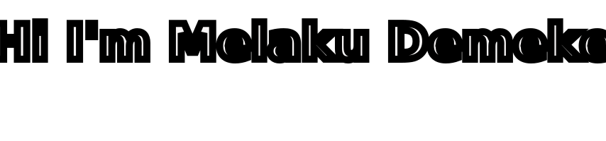

<!DOCTYPE html>
<html>
<body>
    

    
    
    
    

        
    

 <h2 align="center">My Github Stats</h2>

| My github statistics                                                                                                                                                  | Most used languages                                                                                                                                                   | Streaks                                                                                       |
| --------------------------------------------------------------------------------------------------------------------------------------------------------------------- | --------------------------------------------------------------------------------------------------------------------------------------------------------------------- | --------------------------------------------------------------------------------------------- |
|  |  |  |

<h2 align="center">Project</h2>
<table align="center">
    <thead align=center>
        <tr border: none>
            <td><b>📇 Index</b></td>
            <td><b>🛄 Projects</b></td>
            <td><b>👨‍💻 Technology Used</b></td>
            <td><b>⭐ Stars</b></td>
            <td><b>🍴 Forks</b></td>
        </tr>
    </thead>
    <tbody>
        <td align=center>1</td>
        <td>
            <a 
                href="https://github.com/MelakuDemeke/telebirr-php" 
                target="_blank">
                <b>Telebirr Library for PHP</b>
            </a>
        </td>
        <td align=center>PHP</td>
        <td>
            
        </td>
        <td>
            
        </td>
    </tbody>
</table>

<h2 align="center">GitHub Metrics</h2>

  

</body>
</html>

## Languages and Tools:  

 